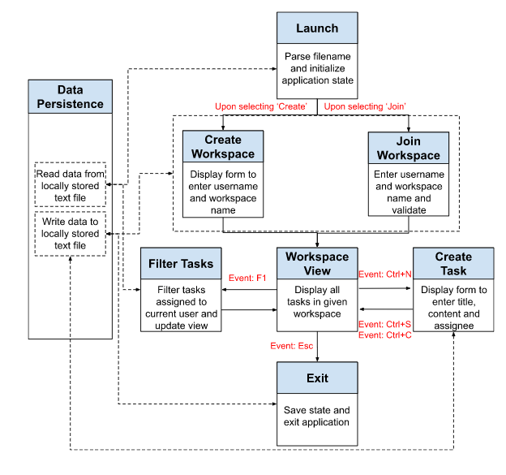

# TUI for Trello

### Overview
Our application is a lightweight collaborative note-taking application where multiple users can be part of the same workspace and assign tasks to each other. The core functionalities of our application are as follows,
1. Allow users to create a new workspace or join an existing workspace.
2. Allow users to add tasks to the workspace. All users within that workspace can view these tasks.
3. Allow users to assign a task to other members of the workspace.
4. Allow users to filter tasks assigned to them.
 

### Application

### Progress so far:
1. Parse the file name as command line argument
2. Read from the file
3. Display dialog box to create or join workspace
4. Create default workspace view with help widget
5. Display form create a task on the event of a defined keystroke

Looking at the current progress and momentum, we expect to meet all our goals within the given time frame and have a fully working application with the core functionalities by the end.
